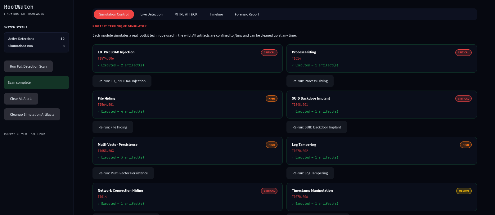
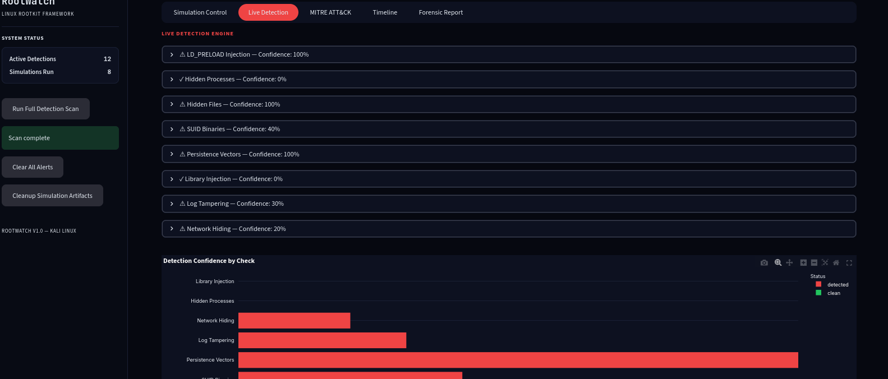
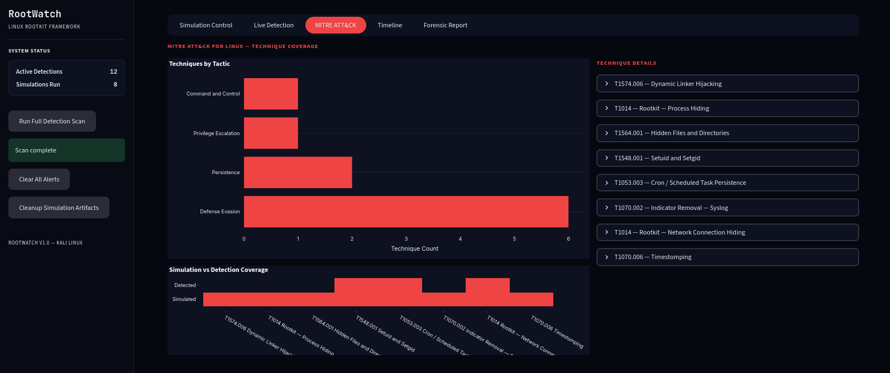
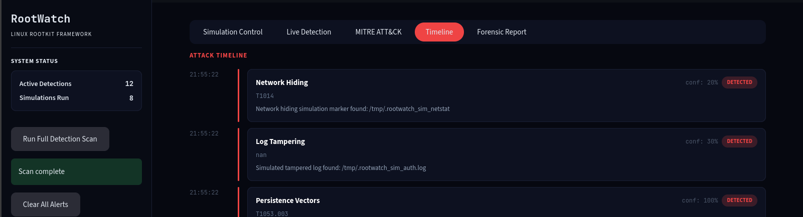
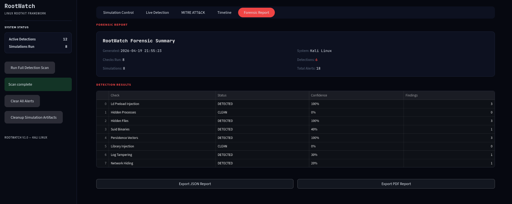

# Advanced Linux Rootkit Simulation and Detection Framework

## Overview

This framework simulates and detects Linux rootkit techniques in a controlled environment. It implements eight techniques used by real-world rootkits and runs a detection engine that cross-references multiple OS data sources to identify them.

The simulation side deploys each technique safely all artifacts are written to /tmp and can be removed at any time. The detection side scans the system using methods that bypass the hooks a real rootkit would install, reading /proc directly rather than relying on userspace tools that can be compromised.

Every technique and detection maps to a MITRE ATT&CK for Linux technique ID.

---

## Dashboard

**Simulation Control — run individual rootkit techniques or all eight at once, each card shows the MITRE technique ID, severity, and execution status**



**Live Detection — cross-references multiple OS data sources simultaneously, each check shows a confidence score and the specific indicators found**



**MITRE ATT&CK — technique frequency by tactic and a coverage heatmap showing which techniques have been simulated and detected**



**Timeline — chronological view of all simulation and detection events with confidence scores and technique IDs**



**Forensic Report — full scan summary with JSON and PDF export**



---

## Techniques Simulated

| Technique | MITRE ID | Severity | Description |
|-----------|----------|----------|-------------|
| LD_PRELOAD Injection | T1574.006 | Critical | Compiles a shared object hooking readdir() and fopen() to hide files and conceal preload configuration |
| Process Hiding | T1014 | Critical | Spawns a background process that would be unlinked from /proc traversal in a real rootkit |
| File Hiding | T1564.001 | High | Creates payload files filtered by the readdir hook, invisible to ls and find |
| SUID Backdoor | T1548.001 | Critical | Drops a shell script that would be compiled and chmod u+s in a real attack |
| Multi-Vector Persistence | T1053.003 | High | Installs cron, systemd unit, and .bashrc LD_PRELOAD export simultaneously |
| Log Tampering | T1070.002 | High | Simulates selective auth.log modification removing attacker activity |
| Network Connection Hiding | T1014 | Critical | Demonstrates /proc/net/tcp filtering to conceal connections from ss and netstat |
| Timestomping | T1070.006 | Medium | Backdates file timestamps to evade timeline-based forensic analysis |

---

## Detection Methods

| Check | Method |
|-------|--------|
| LD_PRELOAD Injection | /etc/ld.so.preload audit, /tmp shared object scan, process memory map analysis |
| Hidden Processes | /proc PID list vs ps output cross-reference |
| Hidden Files | listdir vs glob discrepancy, inode analysis |
| SUID Binaries | find -perm -4000 against known-good whitelist |
| Persistence Vectors | cron directory audit, systemd unit scan, .bashrc analysis |
| Library Injection | /proc/PID/maps scan for libraries loaded from /tmp |
| Log Tampering | Log file size and modification timestamp anomaly detection |
| Network Hiding | /proc/net/tcp vs ss output cross-reference |

---

## Repository Structure

```
Advanced-Linux-Rootkit-Simulation-and-Detection-Framework/
├── simulator/
│   └── techniques.py
├── detector/
│   └── engine.py
├── mitre/
│   └── mapper.py
├── alerts/
│   └── logger.py
├── docs/
│   └── screenshots/
├── requirements.txt
└── README.md
```

---

## Setup

```bash
git clone https://github.com/HevenTafese/Advanced-Linux-Rootkit-Simulation-and-Detection-Framework.git
cd Advanced-Linux-Rootkit-Simulation-and-Detection-Framework
python3 -m venv venv
source venv/bin/activate
pip install -r requirements.txt
sudo apt install gcc -y
```

---

## Usage

Launch the dashboard:

```bash
sudo -E env PATH=$PATH python3 main.py
```

Open `http://localhost:8501`. Run simulations from the Simulation Control tab then click Run Full Detection Scan in the sidebar.

Headless usage:

```bash
sudo python3 main.py --scan
sudo python3 main.py --simulate ldpreload
sudo python3 main.py --cleanup
```

---

## Notes

Some simulation techniques require root access. Run with sudo on Kali Linux. All artifacts are written to /tmp and do not modify any system files. Use the cleanup command to remove all artifacts after testing.

This framework is intended for use on systems you own or have explicit authorisation to test on.
